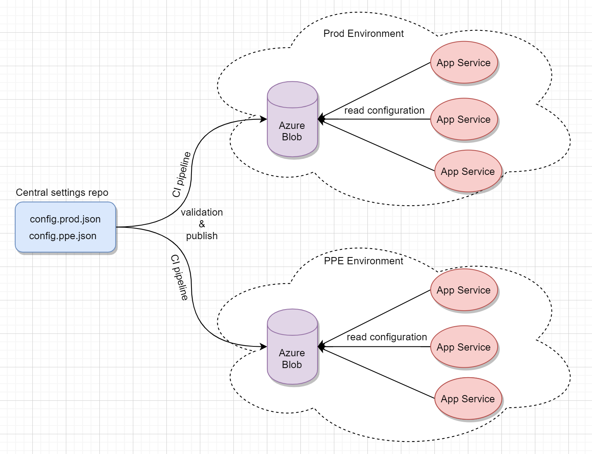

# Microsoft.Extensions.Configuration.AzureBlob

[](https://www.nuget.org/packages/AzureBlobConfigurationExtension/)

Azure blob configuration provider implementation for Microsoft.Extensions.Configuration.


With this extension, multiple instances can share the application settings saved in Azure Blob, and below functionalities are supported:
* auto reload for configuration updates.
* version control with the git repo. 
* high avalibility as the configuration is stored at Azure Blob.

## Workflow


## Usage

Install package:
```
dotnet add package AzureBlobConfigurationExtension
```

Code sample:
```csharp
using Microsoft.Extensions.Configuration.AzureBlob;

Configuration = new ConfigurationBuilder()
                .AddBlobJson(new BlobJsonConfigurationOption
                {
                    BlobUri = "{the_blob_uri}",
                    IsPublic = false,
                    ReloadOnChange = true,
                    LogReloadException = e => logger.LogError(e, e.Message),
                    ActionOnReload = () => logger.LogInformation("Reloaded.")
                })
                .Build();
```


If the provided blob is:

* public => the blob will be accessed directly.
* private with SAS token => the blob will be accessed by the SAS token.
* private without SAS token => the blob will be accessed by MSI/AAD automatically.
